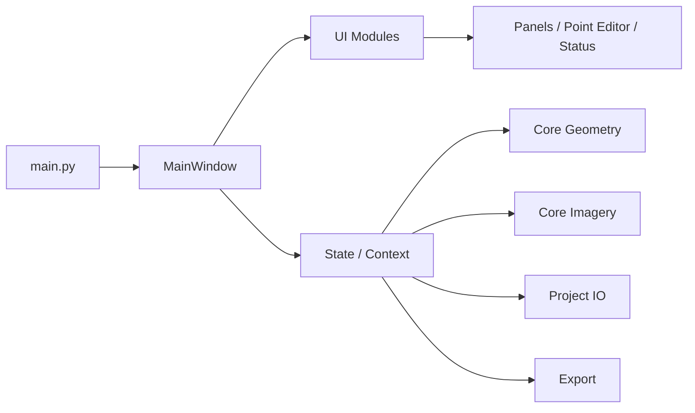

# 🏛️ ArchPhotoLab v0.1.0

고고학 현장 기록을 위한 **사진-도면 정합 데스크톱 도구**입니다.  
드론 사진(메타지오메트리)과 도면 이미지를 대응점 기반으로 맞추고, 정합 결과를 overlay로 빠르게 판단한 뒤, 기록용으로 읽기 쉬운 보정과 PNG 내보내기를 한 번의 흐름으로 수행합니다.


> **공개 원칙 안내**  
> 본 프로젝트는 **GNU GPL 2.0** 기반으로 공개 소스 도구를 지향합니다.  
> 학술·현장 기록 보존 목적의 공유를 위한 공개 도구입니다.

---

## 1) 프로젝트 한눈에 보기

### 핵심 가치를 한 줄로
- 드론 사진 1장 + 도면 1장만으로 정합 워크플로를 끝낼 수 있도록 단일 작업용 도구로 설계.
- 대응점 기반 정합, 품질 점검, 플랫 보정, 결과 저장/복원을 한 화면에서 수행.
- 현장 사용자가 버튼 라벨만 보고도 흐름을 이해하도록 기능 라벨을 작업 목적어 중심으로 정리.

### 현재 지원 범위 (v0.1.0)
- [x] PNG/JPG 이미지 로드
- [x] 좌/우 이미지에서 대응점 클릭 추가, 삭제, 드래그 이동
- [x] 대응점 수량 불일치 경고 및 재정렬 기반 정렬 제어
- [x] 정렬(현재 homography 기본, affine/similarity 병행 지원)
- [x] overlay 보기 + 투명도 슬라이더 + 사진/도면/overlay 보기 전환
- [x] 정합 품질(평균/중앙값/최대/등급/이상점 수) 표시
- [x] 플랫 보정(기록용/강한음영완화/부드러운정리) + 강도 조절 + 비교 모드
- [x] 프로젝트 JSON 저장/복원 (버전업그레이드 대응 포함)
- [x] 3종 PNG export (overlay, flat photo, warped plan)
- [x] 실행 시작 시 스플래시 + icon.png 반영

### 아키텍처


---

## 2) 시작 전 체크리스트

1. Python 3.10 이상이 설치되어 있는지 확인
2. Git 저장소에서 프로젝트를 내려받기
3. 가상환경 생성 후 의존성 설치
4. `python main.py` 실행
5. 순차 버튼: `사진 불러오기` → `도면 불러오기` → `대응점 찍기 시작` → `자동 정합` → `도면 투명도` → `플랫 보정 적용` → `PNG 내보내기`

---

## 3) 환경별 설치 가이드 (정확히)

### 공통
```bash
cd /path/to/ArchPhotoLab
```

### macOS / Linux
```bash
python3 -m venv .venv
source .venv/bin/activate
python -m pip install --upgrade pip
pip install -r requirements.txt
python main.py
```

### Windows (PowerShell)
```powershell
python -m venv .venv
.\.venv\Scripts\Activate.ps1
python -m pip install --upgrade pip
pip install -r requirements.txt
python main.py
```

### Windows (cmd)
```cmd
python -m venv .venv
.venv\Scripts\activate
python -m pip install --upgrade pip
pip install -r requirements.txt
python main.py
```

### GPU 없이도 동작
- 이 프로젝트는 기본 CPU 처리 위주이므로 별도의 CUDA 설정이 필요 없습니다.
- OpenCV는 기본 패키지 사용 기준이므로 CPU만으로 동작 확인이 쉽습니다.

### 권장 실행 방식
- 가상환경 재실행 시에는 의존성 설치를 생략하고 앱 실행만 반복
- 운영체제별 기본 폰트 차이로 글자 모양만 다르게 보일 수 있음

---

## 4) 화면 구성과 핵심 흐름

### UI 구성
- 좌측: 드론 사진 판독 패널
- 우측: 도면 판독 패널
- 하단/우측: 결과 표시 영역(사진/도면/overlay 모드)
- 상단: 1단계 작업 버튼
- 하단: 상태 영역(점 수, 파일, 오류, 정합 품질, 저장 이력)

### 버튼 라벨(작업 목적 중심)
- `사진 불러오기`
- `도면 불러오기`
- `대응점 찍기 시작`
- `자동 정합`
- `도면 투명도`
- `플랫 보정 적용`
- `PNG 내보내기`
- `결과 저장`
- `프로젝트 불러오기`
- `점 다시 맞추기`
- `되돌리기` / `다시 실행`
- `선택점 앞으로` / `선택점 뒤로`
- `선택점 제외 후 정합`

### 권장 워크플로 (처음 사용자를 위한 기본 순서)
1. 사진 불러오기
2. 도면 불러오기
3. 대응점 찍기 시작
4. 양쪽 이미지에 최소 4개 대응점 이상 추가
5. 자동 정합 실행
6. 결과 보기에서 overlay 점검 + 도면 투명도 조절
7. 플랫 보정 적용해서 판독성 비교
8. PNG 내보내기 또는 결과 저장

---

## 5) 파일 구조

```txt
ArchPhotoLab/
├── main.py
├── requirements.txt
├── icon.png
├── archphotolab/
│   ├── constants.py
│   ├── state.py
│   ├── core/
│   │   ├── geometry.py
│   │   ├── imagery.py
│   │   ├── project_io.py
│   │   └── export.py
│   ├── ui/
│   │   ├── main_window.py
│   │   ├── panels.py
│   │   ├── point_editor.py
│   │   ├── status_panel.py
│   │   └── workflow_controller.py
│   └── __init__.py
├── samples/
│   ├── README.md
│   └── project_templates/
│       ├── sample-good.json
│       ├── sample-outlier.json
│       └── sample-shadow.json
└── docs/
    └── qa_checklist.md
```

---

## 6) 프로젝트 저장 형식

프로젝트는 JSON 기반으로 저장됩니다.  
기본 저장 항목은 다음을 포함합니다.

- 앱 버전 및 프로젝트 포맷
- 사진/도면 경로
- 양측 대응점 좌표
- 정합 모드 및 정합 행렬
- overlay opacity
- 품질 점수/경고 정보
- flatten preset 및 강도
- UI/작업 상태(선택점, 단계, 표시 모드)

### 장점
- 재시작 후에도 같은 작업 상태를 재현
- `format_version` 하위호환 로딩을 위한 경고 및 누락값 보강

---

## 7) Export 규칙

- `overlay_result_YYYYMMDD_HHMMSS.png`
- `flat_photo_YYYYMMDD_HHMMSS.png`
- `warped_plan_YYYYMMDD_HHMMSS.png`

내보내기는 사용자가 폴더 위치를 직접 선택할 수 있으며, 결과는 보고서 작성 및 보정 기록 보관용으로 바로 사용 가능합니다.

---

## 8) 알려진 제한사항

- 현재 이미지 확장자는 PNG/JPG/JPEG만 지원합니다.
- 현재는 단일 페어(사진 1장 + 도면 1장) 기준입니다.
- PDF/SVG는 v0.1.0 범위에 포함되지 않습니다.
- 자동 대응점 탐지 기능은 다음 버전 과제로 둡니다.

---

## 9) 문제 해결 안내

### 이미지가 열리지 않을 때
- 파일 확장자가 PNG/JPG인지 확인
- 경로에 한글·공백이 있을 때도 동작은 하지만, 경로 이동 또는 삭제된 파일은 다시 선택해야 함

### 정합이 안 될 때
- 대응점을 4개 이상으로 늘리기
- 양측 대응점 개수 맞추기
- 거의 직선으로 치우친 점 배치인지 확인

### 정합 품질이 나쁠 때
- 이상치로 표시된 대응점 점검
- 점 순서를 재편성/점 이동/점 제외 후 재정합
- 평탄화는 정합 자체 품질을 개선하지 않으므로 정합 품질은 대응점으로 조정

### 실행이 안 될 때
- `pip install -r requirements.txt` 재실행
- 가상환경 활성화 여부 점검
- `.venv` 삭제 후 가상환경 재구축

---

## 10) 기여 및 테스트

코어는 다음 시나리오를 기준으로 검증되어 왔습니다.

- 4개 이상 대응점 정합/삭제/이동 흐름
- 정합 오차 수치와 이상점 색상 경고 표시
- 프로젝트 저장/복원 회귀
- overlay / flat / warped 3종 출력물 생성
- 레거시 형식 `format_version` 로드 호환성

기여 전에는 아래 체크리스트를 통과한 뒤 PR을 권장합니다.  
자세한 항목은 `docs/qa_checklist.md` 참고.

---

## 11) 라이선스

- 라이선스: **GNU General Public License v2.0**
- 공개성: 공공 기록 보존 목적으로 공개 가능한 형태 지향
- 버전: **v0.1.0**

---

## 12) 빠른 시작 체크

- [ ] Python 3.10+ 설치
- [ ] `requirements.txt` 설치 완료
- [ ] 사진/도면 각각 1장 로드
- [ ] 대응점 4개 이상 추가
- [ ] 자동 정합 성공
- [ ] overlay + 도면 투명도 비교
- [ ] 플랫 보정 비교 뷰 확인
- [ ] PNG 3종 내보내기
- [ ] 결과 저장 후 다시 열기

문서가 길어도, 실제로 필요한 첫 동작은 간단합니다.  
`python main.py`를 실행하고, 왼쪽/오른쪽 이미지를 불러온 뒤 순서대로 진행하면 바로 사용할 수 있습니다.
