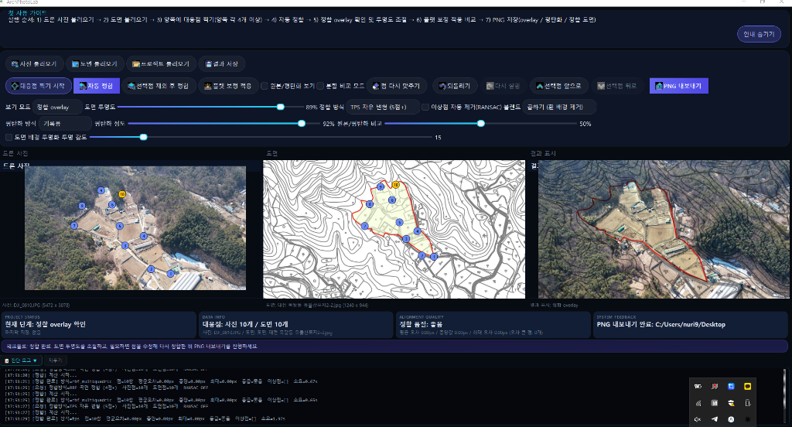
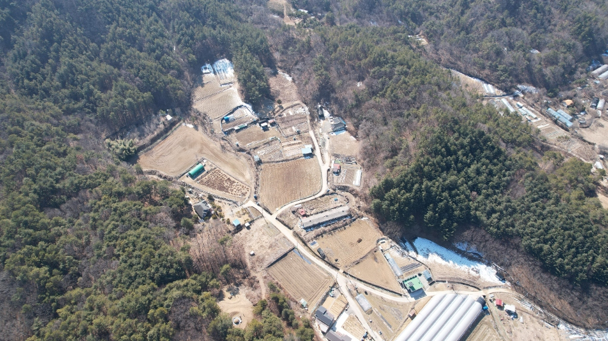
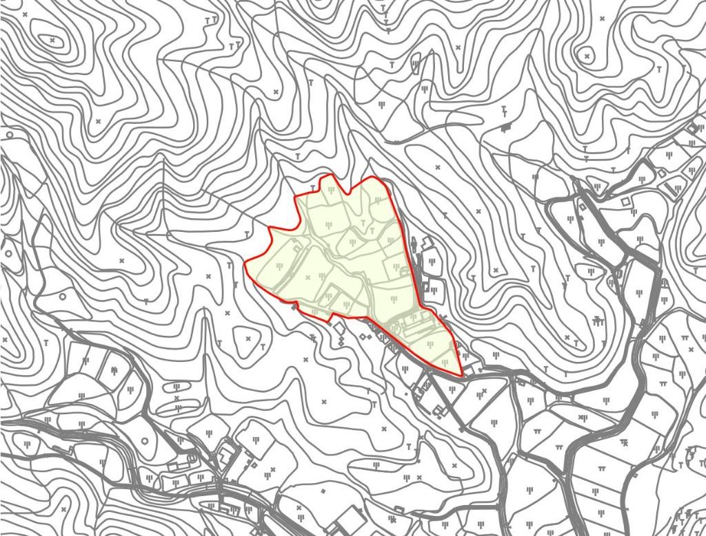
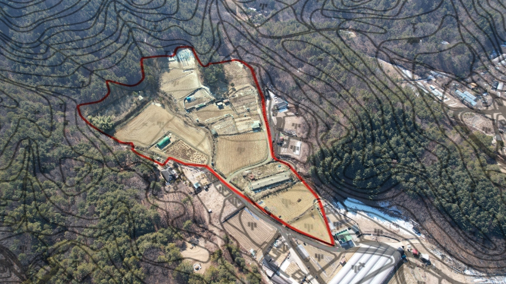

# 🏛️ ArchPhotoLab

> **드론 사진과 고고학 도면을 정밀하게 정합하는 데스크톱 애플리케이션**  
> A desktop tool for aligning drone aerial photos with archaeological site drawings using manual control points.


---

## 📸 어떤 프로그램인가요?

드론으로 촬영한 항공 사진 위에 고고학 지표조사 도면(유구 배치도, 유적 범위 등)을 **정확하게 겹쳐 표시**해 줍니다.  
사진과 도면을 화면에 나란히 띄워놓고, 서로 동일한 지형지물(도로, 건물 모서리, 밭두렁 등)에 **대응점**을 직접 찍어주기만 하면 됩니다.

---

## 🖥️ 메인 화면



| 영역 | 설명 |
|------|------|
| **드론 사진 (좌)** | 원본 드론 항공사진. 클릭하여 대응점을 찍습니다 |
| **도면 (중앙)** | 고고학 도면 또는 배치도. 사진과 동일한 지점에 클릭합니다 |
| **결과 표시 (우)** | 정합 완료 후 도면이 사진 위에 겹쳐진 결과물 |
| **하단 로그** | 오차, 연산 시간, 이상점 진단 등 실시간 정보 표시 |

---

## 🖼️ 사용 예시

아래는 실제 도면과 드론 사진을 정합한 예시입니다. 세 장의 이미지를 순서대로 보시면 정합 과정을 한눈에 이해하실 수 있습니다.

| 1. 드론 항공사진 (입력) | 2. 유적 도면 (입력) | 3. 오버레이 정합 결과 (출력) |
| :---: | :---: | :---: |
|  |  |  |
| 지형지물이 촬영된 드론 사선 사진 | 등고선과 유적 외곽선이 그려진 도면 | 등고선이 지형에 1:1 밀착된 합성 결과 |

---

## 🚀 EXE로 바로 실행하기 (가장 빠른 방법)

Python 설치 없이 **단일 실행 파일**로 바로 사용할 수 있습니다.

### 1️⃣ EXE 파일 준비

- **직접 빌드**: 아래 "빌드 방법" 섹션 참고
- **배포본 사용**: 관리자 또는 팀에서 배포한 `ArchPhotoLab.exe` 파일을 원하는 폴더에 복사

### 2️⃣ 실행

```
ArchPhotoLab.exe
```

더블클릭하거나 터미널에서 실행합니다.  
**Windows Defender** 경고가 뜨는 경우 → `추가 정보 → 실행` 클릭

### 3️⃣ 실행 환경 참고사항

| 항목 | 권장 사양 |
|------|-----------|
| OS | Windows 10/11 (64-bit) |
| RAM | 8GB 이상 (고해상도 사진 처리 시 16GB 권장) |
| 저장공간 | EXE 파일 약 400MB |
| 입력 사진 | JPG, PNG, TIFF (원본 해상도 그대로 사용 가능) |

> 💡 EXE 실행 시 처음 로딩에 **10~20초** 정도 걸릴 수 있습니다. 검은 화면이 잠깐 뜨는 것은 정상입니다.

---

## 🧭 사용 방법 (단계별 안내)

### 1단계 — 사진과 도면 불러오기

1. 상단 **`사진 불러오기`** 버튼으로 드론 사진을 엽니다
2. **`도면 불러오기`** 버튼으로 도면 이미지(JPG/PNG)를 엽니다
3. 두 이미지가 나란히 화면에 표시됩니다

### 2단계 — 대응점 찍기

> 사진과 도면에서 **같은 실제 지점**에 번갈아 클릭합니다. 최소 4쌍 이상, 정밀도를 높이려면 8~10쌍을 권장합니다.

```
좋은 대응점 예시:
  ✅ 도로 교차점, 삼거리 코너
  ✅ 건물 모서리, 담장 끝점
  ✅ 밭 경계선의 꺾이는 지점
  ✅ 수로, 하천의 합류점

피해야 할 지점:
  ❌ 나무 꼭대기, 숲 속 (사진과 도면에서 위치가 다름)
  ❌ 완전히 평탄한 들판 한가운데
  ❌ 계절에 따라 바뀌는 경작지 형태
```

- 대응점은 **번호 순서**가 사진과 도면에서 일치해야 합니다 (1번↔1번, 2번↔2번)
- 잘못 찍은 점은 **더블클릭**으로 삭제, 드래그로 이동 가능합니다

### 3단계 — 정합 방식 선택

| 방식 | 권장 상황 | 필요 최소 점 수 |
|------|-----------|-----------------|
| 유사 변환 | 스케일·회전만 보정할 때 | 2개 |
| 선형 정합 | 평탄한 지형, 수직 촬영 | 3개 |
| 원근 정합 (Homography) | 사선 촬영, 약간의 원근 왜곡 [[1]](#references) | 4개 |
| **TPS 자유 변형** ⭐ | 굴곡 지형, 등고선이 복잡한 경우 [[2]](#references) | 5개 |
| **RBF 곡면 정합** ⭐ | TPS보다 경계부가 자연스러운 고품질 정합 [[3]](#references) | 4개 |
| 2차 다항식 | 렌즈 왜곡이 있는 사선 드론샷 [[4]](#references) | 6개 |
| 3차 다항식 | 복잡한 광학 왜곡, 넓은 지역 [[4]](#references) | 10개 |

### 4단계 — 자동 정합 실행

**`자동 정합`** 버튼을 클릭하면 백그라운드에서 연산이 시작됩니다.  
완료 후 오른쪽 **결과 표시** 창에 도면이 사진 위에 겹쳐집니다.

```
📊 하단 진단 로그 예시:
  [정합 완료] 방식=rbf_multiquadric  점=10쌍  
  평균오차=4.21px  중앙=3.87px  최대=9.05px  등급=좋음
```

- **평균 오차가 10px 미만**이면 우수한 정합입니다
- 이상점(오차가 큰 점)이 표시되면 해당 점을 수정하거나 **`선택점 제외 정합`**으로 제외할 수 있습니다

### 5단계 — 오버레이 조정

| 컨트롤 | 설명 |
|--------|------|
| **불투명도 슬라이더** | 도면의 투명도를 조절합니다 (0~100%) |
| **곱하기 합성 모드** | 도면의 흰 배경이 자동으로 사라지고 선만 보입니다 |
| **조명 평탄화** | 드론 사진의 그림자와 조명 불균일을 보정합니다 |
| **크로마키 배경 제거** | 특정 색상을 투명하게 만들어 도면을 더 깔끔하게 합성합니다 |
| **분할 비교 보기** | 화면을 좌우로 나눠 원본/결과를 슬라이더로 비교합니다 |

### 6단계 — 저장 및 내보내기

- **`프로젝트 저장`**: 현재 작업 상태(이미지 경로, 대응점, 설정값)를 `.json`으로 저장
- **`프로젝트 불러오기`**: 저장된 작업 파일을 그대로 이어서 작업
- **`PNG 내보내기`**: 원본 해상도의 고해상도 PNG 파일로 결과물 저장
  - `overlay_*.png` — 도면 오버레이 합성 결과
  - `flat_*.png` — 조명 평탄화된 드론 사진
  - `warped_*.png` — 정합된 도면만 단독 저장

---

## ⚡ 주요 기능 요약

### 📐 7가지 기하 정합 알고리즘

QGIS 지오레퍼런서 수준의 다양한 변환 방식을 지원합니다:

- **유사·선형·원근 변환**: 빠르고 안정적인 강체 정합. 원근(Homography) 행렬은 SVD 기반 DLT로 추정합니다 [[1]](#references)
- **TPS 자유 변형**: 얇은 판 스플라인(Thin-Plate Spline) 기반 국소 변형. 제어점에 정확히 들어맞으며 굴곡 지형 보정에 탁월합니다 [[2]](#references)
- **RBF 곡면 정합**: Hardy(1971) 멀티쿼드릭 기저함수 기반 산개점 보간법. 경계부 외삽이 자연스러운 고품질 정합을 제공합니다 [[3]](#references)
- **2차·3차 다항식**: 전역 다항식 변환으로 광각 렌즈 왜곡 및 복잡한 지형 보정에 사용합니다 [[4]](#references)
- **이상점 제거(RANSAC)**: 오염된 대응점 중 합의(consensus) 기반으로 내부점(inlier)만 선택하여 강건한 정합을 보장합니다 [[5]](#references)

### 🎨 고급 블렌딩

- **곱하기 합성**: 흰 배경의 도면을 자동 투명화하여 깔끔한 선만 남김
- **크로마키 배경 제거**: 허용 오차(Tolerance) 조절 가능
- **조명 평탄화**: 3가지 프리셋으로 드론 사진 조명 보정

### 📋 실시간 진단

- 재투영 오차(평균/중앙/최대) 수치화
- 이상점 자동 감지 및 제외 정합
- 정합 품질 등급 표시 (좋음 / 보통 / 불안정)
- 백그라운드 스레드 처리로 UI 응답성 유지

---

## 🛠️ 소스에서 실행하기

### 요구 사항

- Python 3.10 이상
- Windows / macOS / Linux

### 설치 및 실행

```bash
# 저장소 클론
git clone https://github.com/lzpxilfe/ArchPhotoLab.git
cd ArchPhotoLab

# 가상환경 생성 (권장)
python -m venv .venv

# 가상환경 활성화
# Windows:
.\.venv\Scripts\Activate.ps1
# macOS/Linux:
source .venv/bin/activate

# 의존성 설치
pip install -r requirements.txt

# 실행
python main.py
```

---

## 📦 EXE 직접 빌드하기

### 1. PyInstaller 설치

```bash
pip install pyinstaller
```

### 2. 빌드 실행

```powershell
pyinstaller --clean ArchPhotoLab.spec
```

빌드 완료 후 `dist/ArchPhotoLab.exe` 파일이 생성됩니다.  
이 파일 하나만 복사하면 Python 없이 어디서든 실행 가능합니다.

> ⚠️ 빌드 시 경고 메시지(WARNING)가 일부 출력되는 것은 정상입니다.  
> `Building EXE from EXE-00.toc completed successfully.` 메시지가 나오면 성공입니다.

---

## 📂 프로젝트 구조

```
ArchPhotoLab/
├── main.py                  # 진입점
├── ArchPhotoLab.spec        # PyInstaller 빌드 설정
├── requirements.txt
├── docs/
│   └── images/              # README 예시 이미지
├── archphotolab/
│   ├── constants.py         # 전역 상수 정의
│   ├── state.py             # 앱 상태 관리
│   ├── core/
│   │   ├── geometry.py      # 정합 알고리즘 (7가지 방식)
│   │   ├── imagery.py       # 이미지 처리 및 블렌딩
│   │   ├── export.py        # PNG 내보내기
│   │   └── project_io.py    # 프로젝트 파일 저장/불러오기
│   └── ui/
│       ├── main_window.py   # 메인 윈도우 UI
│       ├── panels.py        # 이미지 패널 및 점 편집
│       ├── workflow_controller.py  # 정합 워크플로우 제어
│       └── status_panel.py  # 상태 및 품질 패널
```

---

## 📚 References

이 소프트웨어에 구현된 알고리즘의 학술적 근거입니다.

[1] Abdel-Aziz, Y. I., & Karara, H. M. (1971). **Direct linear transformation into object space coordinates in close-range photogrammetry.** *Proceedings of the ASP Symposium on Close-Range Photogrammetry.* — 동차 좌표계 기반 투영 행렬(Homography) 추정의 수학적 토대.

[2] Bookstein, F. L. (1989). **Principal warps: Thin-plate splines and the decomposition of deformations.** *IEEE Transactions on Pattern Analysis and Machine Intelligence*, 11(6), 567–585. <https://doi.org/10.1109/34.24792> — TPS(얇은 판 스플라인) 변환의 원논문. 비강체 이미지 정합의 수학적 기초.

[3] Hardy, R. L. (1971). **Multiquadric equations of topography and other irregular surfaces.** *Journal of Geophysical Research*, 76(8), 1905–1915. <https://doi.org/10.1029/JB076i008p01905> — 멀티쿼드릭 RBF 보간법의 원논문. 산개 데이터의 연속면 모델링 기법 제안.

[4] Goshtasby, A. (1988). **Registration of images with geometric distortions.** *IEEE Transactions on Geoscience and Remote Sensing*, 26(1), 60–64. <https://doi.org/10.1109/36.3000> — 2차·3차 전역 다항식 변환을 이용한 기하 왜곡 보정 방법론.

[5] Fischler, M. A., & Bolles, R. C. (1981). **Random Sample Consensus: A paradigm for model fitting with applications to image analysis and automated cartography.** *Communications of the ACM*, 24(6), 381–395. <https://doi.org/10.1145/358669.358692> — RANSAC 알고리즘 원논문. 이상점(outlier)을 포함한 데이터에서 강건한 모델을 추정하는 패러다임.

---

## 📄 라이선스

이 저장소는 `GNU General Public License v2.0`을 따릅니다. 자세한 내용은 [LICENSE](LICENSE)를 확인하세요.

---

## 💬 인용

이 도구가 연구, 수업, 현장 업무에 도움이 되었다면 아래 버튼으로 인용해 주세요 🙏

[](https://github.com/lzpxilfe/ArchPhotoLab)
[](https://github.com/lzpxilfe/ArchPhotoLab)

인용 메타데이터는 [CITATION.cff](CITATION.cff)에 보관합니다.
